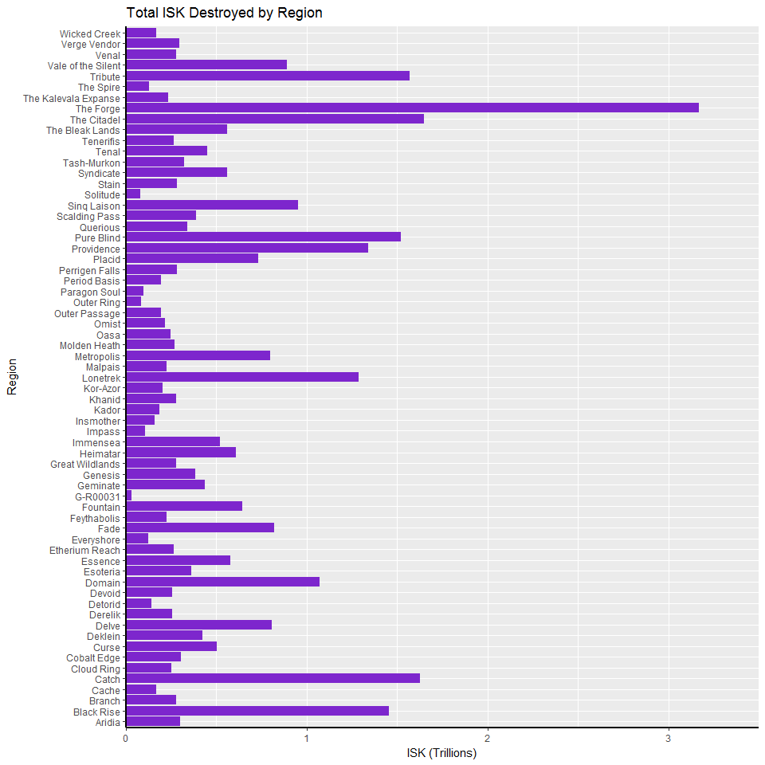

Summary Statistics for Eve Online in November
================

Introduction
------------

Below we will use summary statistics to try and recreate some of the information shown in the Power BI Pictures folder. Datasets have been provided by CCP Quant located at <https://community.eveonline.com/news/dev-blogs/monthly-economic-report-november-2016/>

### Pre-Amble

First we will need to include the ggplot2 library

``` r
library(ggplot2)
```

### Graphs and Code

``` r
RegionalStats <- read.csv("data/RegionalStats.csv") #Import the data from the csv
options("scipen"=999, "digits"=4) #stops R from using Scientific Notation when viewing destroyed ISK
regionName <- RegionalStats$regionName
totalDest <- c(RegionalStats$total.destroyed)

totalDest <- totalDest*0.000000000001 #Brings the ISK value to more viewable number (in the Trillions)

df <- data.frame(regionName, totalDest) #Creates a dataframe for use in ggplot

ggplot(data=df, aes(x=regionName, y=totalDest)) + geom_bar(fill="purple3", stat="identity", linetype=2) + 
  scale_fill_hue () + 
  coord_flip() +
  theme(axis.line = element_line(color = "black", size=1, linetype="solid")) +
  labs(title = "Total ISK Destroyed by Region", y="ISK (Trillions)", x="Region") +
  scale_y_continuous(expand = c(0,0), limits = c(0,3.5))
```

 Test Sync
